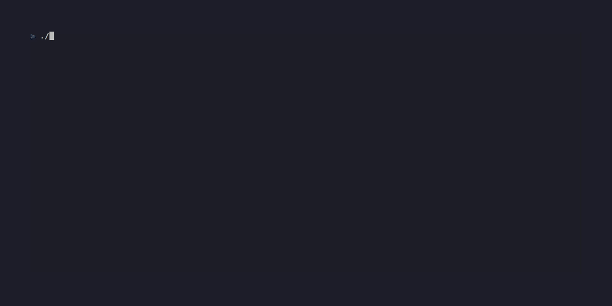
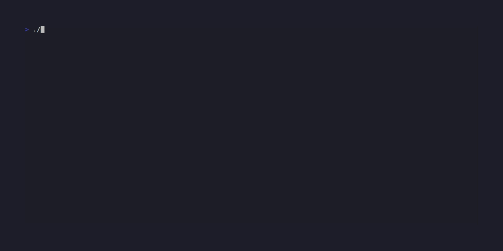

# solituire

> Klondike Solitaire in your terminal, built with [Bubbletea](https://github.com/charmbracelet/bubbletea) and [Lipgloss](https://github.com/charmbracelet/lipgloss).



## Features

- **Full Klondike rules** — draw-1 and draw-3 modes, unlimited stock recycling
- **Keyboard, mouse & vim keys** — arrows, hjkl, number shortcuts, click to select
- **Undo / Redo** — every move is reversible with `Ctrl+Z` / `Ctrl+Y`
- **Hint engine** — press `?` to highlight a valid move
- **Auto-move** — press `f` to send a card to the foundation automatically
- **5 built-in themes** — Classic, Dracula, Solarized Dark, Solarized Light, Nord
- **Seeded games** — replay any game exactly with `--seed`
- **Score & timer** — standard Klondike point system tracked in the header



## Installation

Requires Go 1.24+.

```bash
git clone https://github.com/rrotaru/solituire
cd solituire
go build -o klondike .
./klondike
```

## Usage

```
./klondike [flags]

Flags:
  --seed int    RNG seed for the deal (0 = random)
  --draw int    Cards to draw per stock flip: 1 or 3 (default 1)
```

When `--draw` is supplied the menu is skipped and the game starts immediately.

```bash
# Random game, pick draw mode in the menu
./klondike

# Reproducible draw-3 game
./klondike --seed 42 --draw 3
```

## Controls

| Key(s) | Action |
|---|---|
| `←` `→` / `h` `l` | Move cursor between piles |
| `↑` `↓` / `k` `j` | Move cursor within a tableau column |
| `1`–`7` | Jump to tableau column |
| `Tab` | Cycle to next pile |
| `Enter` | Pick up / place selected card |
| `Space` | Draw from stock |
| `f` | Auto-move selected card to foundation |
| `?` | Show a hint |
| `Ctrl+Z` | Undo |
| `Ctrl+Y` | Redo |
| `t` | Cycle theme |
| `p` | Pause / resume |
| `F1` / `H` | Help overlay |
| `Escape` | Cancel selection / dismiss overlay |
| `q` | Quit |
| Mouse click | Select and place cards |

## Themes

Cycle through themes in-game with `t`, or select one from the start menu.

| Name | Description |
|---|---|
| Classic | Green felt — the timeless Solitaire look |
| Dracula | Purple and pink on dark backgrounds |
| Solarized Dark | Warm tones on the Solarized dark base |
| Solarized Light | Warm tones on the Solarized light base |
| Nord | Cool blues and greys from the Nord palette |

## Scoring

| Action | Points |
|---|---|
| Waste → Tableau | +5 |
| Waste → Foundation | +10 |
| Tableau → Foundation | +10 |
| Foundation → Tableau | −15 |
| Flip face-down card | +5 |
| Recycle stock | −100 |

Score never goes below 0.

## Development

```bash
# Run all tests
go test ./...

# Build
go build -o klondike .

# Visual regression (requires Docker + VHS image)
docker run --rm --privileged --shm-size=512m \
  -v "$PWD:/vhs" -w /vhs \
  ghcr.io/charmbracelet/vhs tapes/board-initial.tape
```

Terminal must be at least **78 × 25** characters; the game shows a warning if the window is too small.

## License

See [LICENSE](LICENSE).
